<!DOCTYPE html>
<html lang="en">
<head>
  <title>Sahil Sachin Donde</title>
  <meta charset="utf-8">
  <meta name="viewport" content="width=device-width, initial-scale=1">
  <link rel="stylesheet" href="https://maxcdn.bootstrapcdn.com/bootstrap/3.4.1/css/bootstrap.min.css">
  
  

  
  <link rel='stylesheet' href='jquery-ui/jquery-ui.css'>
  <link rel='stylesheet' href='jquery-ui/jquery-ui-structure.css'>
  <link rel='stylesheet' href='jquery-ui/jquery-ui-theme.css'>

</head>
<body bgcolor="#F1F3F6">

<nav class="navbar navbar-inverse" style="top:0; right:0; left:0; position:fixed; z-index: 23;">
  

    

      <button type="button" class="navbar-toggle" data-toggle="collapse" data-target="#myNavbar">
        
        
                                
      </button>
      <a class="navbar-brand" href="#co" style='font-family: Trebuchet MS, sans-serif;
  font-size:19px; color:white;'>Sahil - Portfolio</a>
    

    

      <ul class="nav navbar-nav navbar-right">
        <li><a id='abc' href="#h">Home</a></li>
        <li><a id='abc' href="#am">About Me</a></li>
        <li><a id='abc' href="#S">Skills</a></li>
        <li><a id='abc' href="#mp">Projects</a></li>
        <li><a id='abc' href="#cer">Certificates</a></li>
        <li><a id='abc' href="#art">Artworks</a></li>
        <li><a id='abc' href="#cd">Contact</a></li>
      </ul>
    

  

</nav>

    

 

<table align='center' >
  <tr>
    <td align='center'>
         </td>
  </tr>
</table>
<h2 align='center' id='f' style="font-family:Comic Sans MS; font-size:45px; color:white;"><b>Sahil Donde</b></h2>

<i><b>Oracle Certified | Web Development & ML Enthusiast | 5&#127775 @ HackerRank</b></i> 
  

<i><b>3rd Year Computer Science student at VIT Chennai</b></i>
  
<i><b><a id='res' href='https://drive.google.com/file/d/1NbqMFjYda8epc6kK-X64H0PkNNcdCuJ2/view?usp=sharing' target="_blank">Resume</a></b></i>    
    
     <h2 align='center' style="font-size:40px; font-family:Times-Italic; background-color:#F1F3F6";><i> <b>About Me </b></i></h2> 
    
I am currently pursuing my Btech in Computer Science & Engineering from VIT University Chennai Campus. I like bilding Web Applications, Desktop Applications, Machine Learning models and making various Illustrations (Adobe Illustrator). There is a lot to learn in Web Development and Graphic Designing from my side and looking forward to make some projects on the same. Besides, for refreshments I spent my time doing designing (photo/video editing), play many outdoor games and listen to good music.
 
    

        <table border=0px style="width:1650px; margin-left:20px; margin-right:20px;" >
          <tr>
            <td style='padding:20px'>
          

            

              
                
                

                  
As a CS student, I have always been fond of <b><u>building responsive Web Apps</b></u> with HTML, CSS, JavaScript and PHP using servers and have worked on many projects in the same

                

              
            

          

        </td>
        
        <td style='padding:20px'>
          

            

              
                
                

                  
I am very passionate about Designing, so I spent my leisure time by making various <u><b>illustrations, re-designing logos & business cards</b></u> for comapanies & <u><b>making posters</b></u> for various events.

                

              
            

          

          </td>

          <td style='padding:20px'>
          

            

              
                
                

                  
Being a tech student, I love editing code and like to see the resulting output on screen. Often in my freetime I work on my <u><b>audio/video editing and photo editing skills</b></u>.

                

              
            

          

          </td>
        <td style='padding:20px'>
          

            

              
                
                

                  
From my chidlhood, I am always passionate of <u><b>playing sports especially cricket</b></u>. Whenever I am tired from my daily routine I just go on the field and play cricket with my friends.

                

              
            

          

        </td>
        
      </tr></table>
      

  
              
      <table align='center'>
        <tr colspan=2>
          <td align='center'><h2 style="font-size:40px; font-family:Times-Italic;"><i><b>Educational Qualifications </b></i></h2></td>
        </tr>
        <tr>
          <td align='center'><h4 style="font-size: 19px; font-family:Trebuchet MS; line-height:35px;">Currently persuing B-tech in Computer Science and Engineering from <q>VIT Chennai</q> :- 9.14 / 10</b></h4></td>
        </tr>
        <tr>
          <td align='center'><h4 style="font-size: 19px; font-family:Trebuchet MS; line-height:35px;">12th (HSC Science with CS, Maharashtra State Board) from <q>Bhavans College</q>, Mumbai :- 87.1%</h4></td>
        </tr>
        <tr>
          <td align='center'><h4 style="font-size: 19px; font-family:Trebuchet MS; line-height:35px;">10th (SSC, Maharashtra State Board) from <q>Bhavans A.H. Wadia High School</q>, Mumbai :- 90.6%  </h4></td>
        </tr>
      </table>
  
      <table align='center' width=100% id='t4'>
        <tr><td>
          <h2 align='center' style="font-size:40px; font-family:Times-Italic;"><i><b>Skills</b></i></h2></td>
        </tr>
        <tr><td>
Following are my technical skills and some of which I have used in my projects
  </td></tr>
      </table>
      
      

      <table align='center' bgcolor="white" width=100% id='t4'>
        <tr>
          <td align='center' width=20%>    </td>
          <td align='center' width=20%>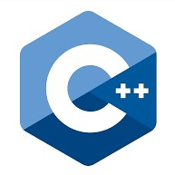    </td>
          <td align='center' width=20%>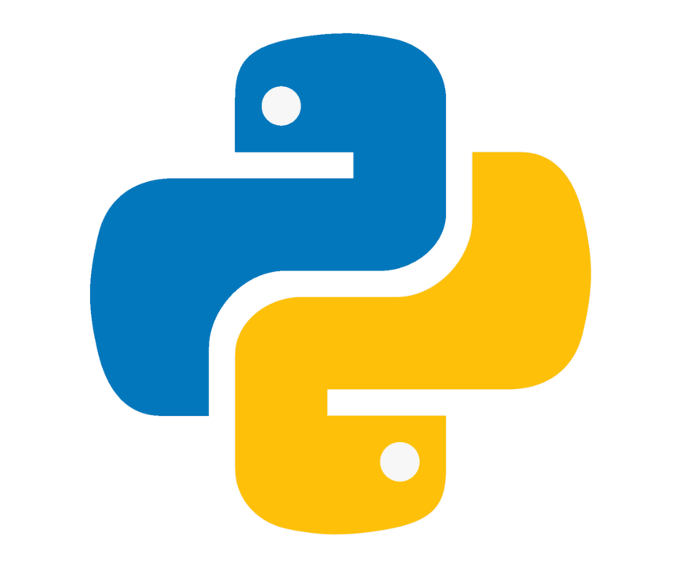    </td>
          <td align='center' width=20%>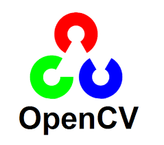    </td>
        </tr>
      
          <tr>
          <td align='center' width=20%>    </td>
          <td align='center' width=20%>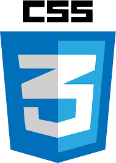    </td>
          <td align='center' width=20%> 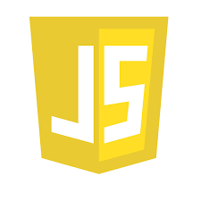    </td>
          <td align='center' width=20%>    </td>
        </tr>
      
        <tr>
          <td align='center' width=20%>    </td>
          
          <td align='center' width=20%>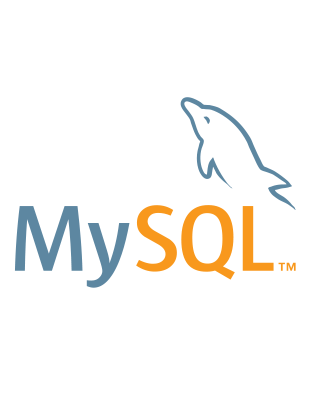    </td>
          <td align='center' width=20%>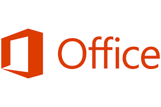    </td>
          <td align='center' width=20%>    </td>
        </tr>
      </table> 
      

        
      

      

         
        <h2 align='center' style="font-size:40px; font-family:Times-Italic;"><b><i>My Projects</i></b></h2>
          

      
      <table align='center'>
        <tr><td><button class="w3-button w3-display-left w3-black" onclick="plusDivs(-1)">&#10094;</button>&nbsp;&nbsp;</td>
        <td><button class="w3-button w3-display-right w3-black" onclick="plusDivs(1)">&#10095;</button></td></tr>
      </table>
       
      

        <h1 align='center' id='i3'>(1/9) &nbsp;&nbsp;&nbsp;<b>E-commerce - Web App</b></h1> 
        

        

            
            
 I built a reponsive and user-friendly e-commerce shopping website which includes both front-end and back-end both <b>Concepts used in this code are:</b> 
                Frontend languages - HTML5 - CSS3 - JavaScript -   Backend language - PHP 
            <b> Working model of the project:</b>
            1. Firstly there is a home page just for viewing
            2. Then the user must register himeself and login for buying the products 
            3. There is an option given to update the details of the user,forgot pass  and update password
            4. User can select many products at a time and collect his/her products in the cart and go for buying all 
            5. Finally after payment the user gets a reciept
            6. The user can view all his orders which he/she has bought till date. <a href='https://drive.google.com/file/d/116Zx-YiQbtEnM5-luutiiAc4sJUX1lvl/view?usp=sharing' target='_blank'>Have a Look</a>

        

      

      
      

        <h1 align='center' id='i3'>(2/9) &nbsp;&nbsp;&nbsp;<b>Tic-Tac-Toe - Game</b></h1> 
       

        

            
            
 I made a user friendly Tic-Tac-Toe game using C++, majorly using arrays concept. <b>Concepts used in this code are:</b> -1D Arrays - 2D Arrays - Generating random number - - Conditional Statements i.e. IF and ELSE
              - Getting input from user - Adding wait/sleep in program - Conditional loops 
              <b>What is happening in the Game: </b> 
              1- Display the welcome message
              2- Collect the player's names
              3- Until one of the player wins do the following:
              3.1- A toss happens and whoever wins the toss will start first
              3.2- Users have the option of choosing x/0
              3.3- As soon as all 3 rows/columns of a user is filled by the same character that user wins.
              3.4- If no one wins then the game stops with the message saying that match drawn Click the given link and download the game and make sure you open it in a desktop.  <a href='https://drive.google.com/file/d/11-gMvSbDmat6ehWu0JKjmOd6ktG0MDq-/view?usp=sharing' target="_blank">Download the Game</a>

        

      

      
      

        <h1 align='center' id='i3'>(3/9) &nbsp;&nbsp;&nbsp;<b>Snakes & Ladders - Game</b></h1> 
        

        

          
            
 I wrote a python program to play text-based snake and ladder game in the terminal. <b>Concepts used in this code are:</b> 
              - Dictionary
              - List
              - Generating random number
              - Selecting a Random value from a list
              - Adding wait/sleep in program
              - Conditional Statements i.e. IF and ELSE
              - Getting input from user 
              <b>What is happening in Game:</b> 
              1- Display the welcome message
              2- Collect the player's names
              3- Until one of the player wins do the following:
              3.1- Roll the dice
              3.2- Move the player forward for the value got on the dice roll.
              3.3- If the player is on snake's head, move down to its tail
              3.4- If the player is on ladder's bottom, take it to its top
              3.5- else remain there and let the second player roll the dice Click the given link and download the game and make sure you open it in a desktop <a href='https://drive.google.com/file/d/1yLYlGRoCGHSOD0sqoOIXuIkzTqHF7tHh/view' target="_blank">. Download the Game</a>

        

      

      

        <h1 align='center' id='i3'>(4/9) &nbsp;&nbsp;&nbsp;<b>Snake eating Food - Game</b></h1> 
        
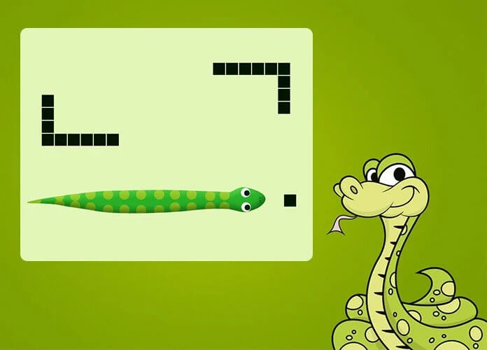

        

            
            
 I built a Graphical based Snake Game using the Turtle library of Python.  <b>Tools and Concepts used in this code are:</b> 
                Turtle library of Python 
            <b> Description of the project:</b>
            Here as the snake grows bigger in size, you will notice that its speed reduces.
Here everything in the screen is a turtle - head of the snake, body of the snake and also the food.
When the snake eats the food, a turtle in the form a body is been attached to the snake.
The user will be out only when the head of the snake touches any of the body turtle.
For the boundaries I haven't declared the user as out, instead the snake can pass through the boundary and would come out from the opposite side of the boundary. <a href='https://drive.google.com/file/d/1_V13ih2oTxWTRL887r-SgN0MfEfgkFPr/view' target='_blank'>Have a Look</a>

        

      

      

        <h1 align='center' id='i3'>(5/9) &nbsp;&nbsp;&nbsp;<b>Notepad Clone - Desktop App</b></h1> 
        

        

            
            
 I built a Desktop based Application - Notepad Clone using the Swing library of Java.  <b>Tools and Concepts used in this code are:</b> 
                Java - Swing 
            <b> Description of the project:</b>
            Built a Notepad clone using the file handling concepts and the swing library which is built on top of the Java AWT
Got to learn many new things while implementing the same
Functionalities included: -
1) Saving the file
2) Opening the existing file
3) Editable operations like Undo and Redo
4) Wrapping the lines and the words
5) Changing the font size, font style and font family of the text
6) Changing the background and foreground color <a href='https://drive.google.com/file/d/1deAastnvyNbHk_8W4AInh04Vtq6z1chq/view' target='_blank'>Have a Look</a>

        

      

      

        <h1 align='center' id='i3'>(6/9) &nbsp;&nbsp;&nbsp;<b>Banking - Web App (Team of 2)</b></h1> 
        
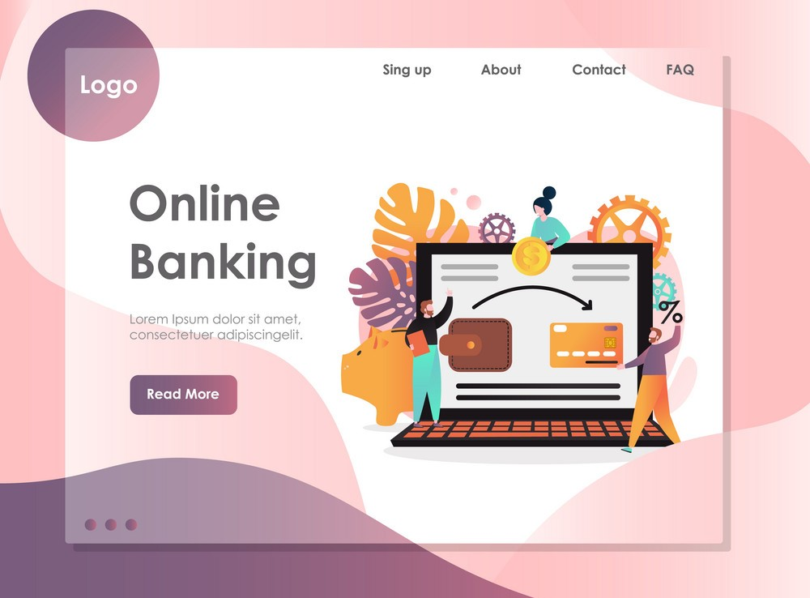

        

            
            
 I and my teammate built a reponsive and user-friendly e-bank website which includes both front-end and back-end both <b>Tools and Concepts used in this code are:</b> 
                Frontend languages - HTML5 - CSS3 - JavaScript -   Backend language - PHP 
            <b> Description of the project:</b>
            Myself, Sahil Donde and my teammate Krunal Kumbhare worked on a Web Development Project. We built an Online Banking Portal where you can transfer money to other users, can have a close watch on all your transactions, open a fixed deposit and apply for loans. We have also include the employee side of the system where the employee can view the user details and can approve/disapprove the loans based on the EMI
Frontend: - HTML, CSS and JS, Backend: - PHP, Database: - MySQL <a href='https://drive.google.com/file/d/1pO2IbsqlGQ1qaC_davW4yYqHPYYCr-0t/view' target='_blank'>Have a Look</a>

        

      

      

        <h1 align='center' id='i3'>(7/9) &nbsp;&nbsp;&nbsp;<b>EAST (Easy & Secure Test) Quiz - Web App (Team of 4)</b></h1> 
        
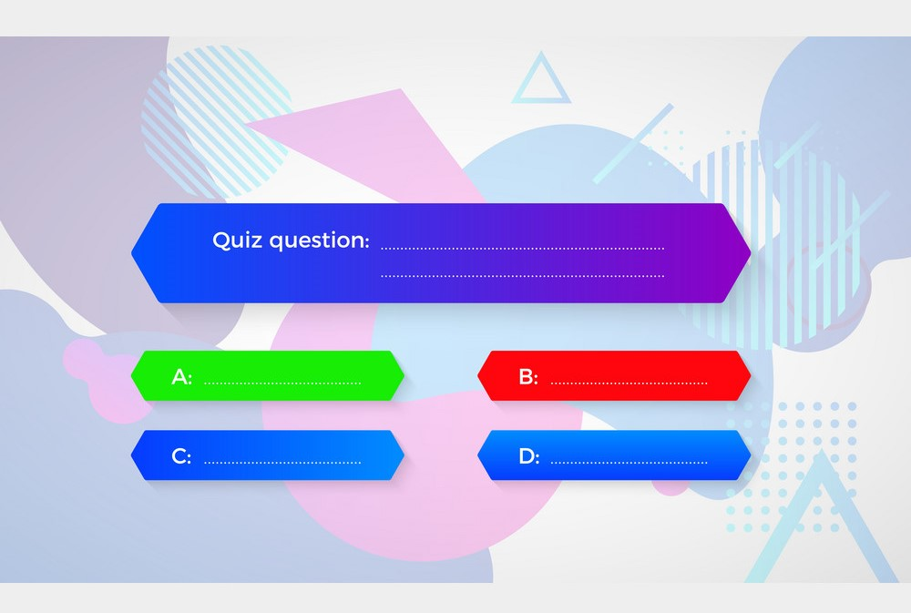

        

            
            
 I and my 3 teammates built a reponsive and user-friendly e-quiz website which includes both front-end and back-end both <b>Tools and Concepts used in this code are:</b> 
                Frontend languages - HTML5 - CSS3 - JavaScript -   Backend language - PHP 
            <b> Description of the project:</b>
            Myself, Sahil Donde and my teammate Ninad Topale, Sangramjit Hazarika and Krunal Kumbhare worked on a Web Development Project. We built an Online Quiz Portal which would be beneficial to all the schools and colleges who don't have any facility to take the examination sector in to a full fleshed online mode. This portal would have 2 main sections - Faculty and Students. Each of the faculty and Students of the schools/colleges who wants to avail our services needs to register in our portal.Faculty can set the question paper and the exam timing. After setting the test/quiz, a unique test id would be generated which would be given to only those who are under that faculty. Once the student enters the test id at the scheduled time only then the student can attempt the test. After the test, the student can see the result and can see where he has done the mistake. The evaluation of the test will done by the faculty on the other side. There is also an option of chat where faculties and students can chat among themselves for any doubt clearification. <a href='#' target='_blank'>Have a Look</a>

        

      

      

        <h1 align='center' id='i3'>(8/9) &nbsp;&nbsp;&nbsp;<b>Housing Real Estate - Desktop App (Team of 3)</b></h1> 
        
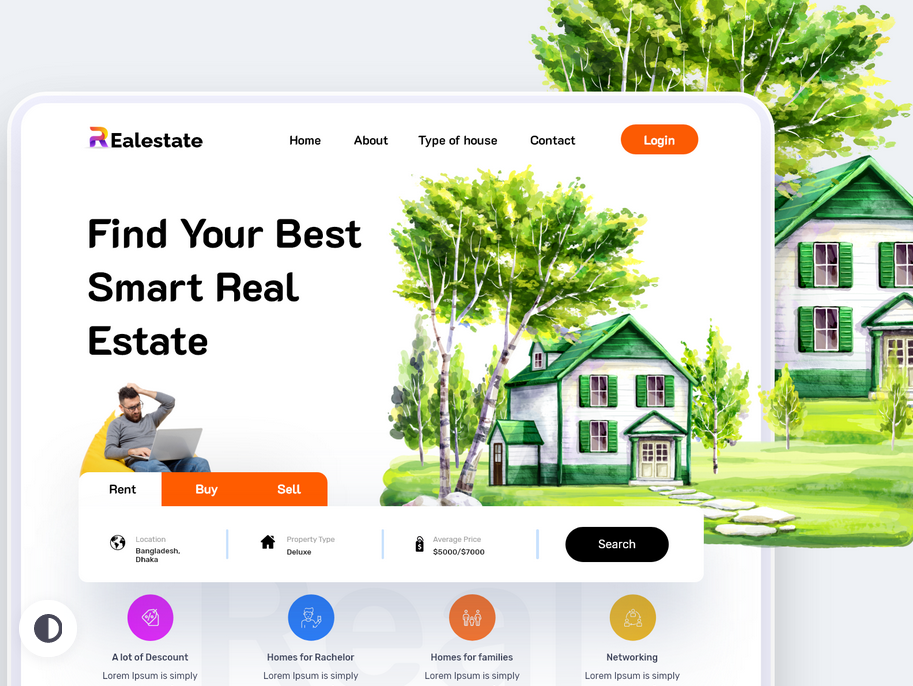

        

            
            
 I and my 2 teammates built a Desktop based Application - Real Estate App using the Swing library of Java. <b>Tools and Concepts used in this code are:</b> 
                Java - Swing, MySQL Database 
            <b> Description of the project:</b>
            Myself, Sahil Donde and my teammates Sangramjit Hazarika and Ninad Topale worked on a Desktop based App Project. We built an Online Real Estate Portal where First, any user which is interest in either buying or selling the house registers on the portal with the basic required details. Once he is been registered then he needs to login with the help of the credentials set by him at the time of registration
So, all home seller, home buyers, renters and tenants become registered users. After login the user needs to select one of the 4 roles.
For a home seller, he needs to list the houses for selling by giving all the details like house location, landmarks, price, room size and also, he needs to give the bank details of his account as the money received by the portal by the buyers needs to be transferred to the account of the corresponding seller. The same case goes with the renters, just he needs to give the monthly rent along with other details
For a home buyer, he would see a list of all the houses available on the portal listed by all sellers. He can filter the houses by setting the priorities based on the landmarks, location and price. For a complete detailed information of a particular house, he needs to click the house and can view.
Then he can go for the payment and by entering the account no, MICR code and the IFSC code and also the monthly debited money from the buyer’s account. So, the entered monthly amount will be auto debited every month from the buyer’s account and be transferred to our account which would be transferred to the corresponding seller. Same goes with the tenants. At the end the buyer and the seller are been given a confirmation email about the status of the transaction for the house
 <a href='#' target='_blank'>Have a Look</a>

        

      

      

        <h1 align='center' id='i3'>(9/9) &nbsp;&nbsp;&nbsp;<b>Operating System - Desktop App (Team of 3)</b></h1> 
        
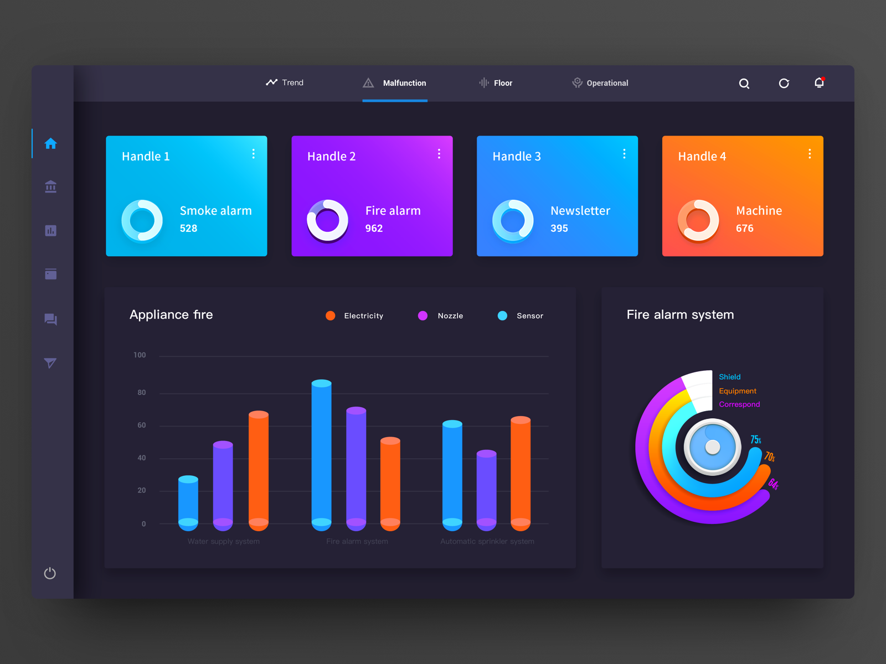

        

            
            
 I and my 2 teammates built a Desktop based Application - Operating System - A study tool  using the Swing library of Java. <b>Tools and Concepts used in this code are:</b> 
                Java - Swing, MySQL Database 
            <b> Description of the project:</b>
            Myself, Sahil Donde and my teammates Sangramjit Hazarika and Ninad Topale worked on a Desktop based App Project. We built an Operating System - Virtual Machine where our system would have various small applications like calculator, calendar, alarm clock, stop watch, mailbox, etc.
We have the Task Manager as it is one of the OS concept in our system. Apart from this we have also implemented the conecpt of caching. Only that application which would be used the most no. of times by the user would be present in the cache memory.
The main intention to go for this project is that to understand the OS concepts to the users in a more practical and in fun way. This can be useful to those who don't have any computer knowledege. As just by reading the concepts they won't get it. So using our VM, they can get the live demo of how the OS allots memory and releases it. Also they would understand the concept of caching
Each of these applications which I mentioned would take some amount of memory consumption and CPUs attention. So to manage the memory and CPU along with the applications we have come up with a app named Task Manager where we can monitor the memory consumption and the CPUs attention to each of the opened apps. The task manager also keeps the track of the no. of tabs opened and thus updates the CPU and memory consumption accordingly in the task manager. We have tried to make it dynamic so that if any tab is opened or closed then the values would be affected then and there. Similarly if any tab is closed so, that much amount of CPUs attention would be released and parallely the memory would also be released which was alloted to that app.
Also, we have set a limit of RAM. So, if the RAM size exceeds the limit and if we try to open another app, then from among the apps opened the app which has less priority would be closed and the new app will be opened. <a href='https://drive.google.com/file/d/1pO2IbsqlGQ1qaC_davW4yYqHPYYCr-0t/view' target='_blank'>Have a Look</a>

        

      

      <table align='center'>
        <tr><td><button class="w3-button w3-display-left w3-black" onclick="plusDivs(-1)">&#10094;</button>&nbsp;&nbsp;</td>
        <td><button class="w3-button w3-display-right w3-black" onclick="plusDivs(1)">&#10095;</button></td></tr>
      </table>
      
      

      
      
  
<table align='center' width=100% style="background-color: white;">
  <tr><td>

  

          
        <h2 align='center' style="font-size:40px; font-family:Times-Italic;"><b><i>Certifications</i></b></h2>
          

  

        <h1 style="font-size: 22px; font-family:Trebuchet MS;  line-height:35px;">&nbsp; &nbsp;Microsoft Technology Associate (MTA)</h1>
        
 - Microsoft Technology Associate (MTA): Introduction to Programming using Python 
           - Microsoft 
           - Issued June 2021 - No Expiration Date 
           - <a href='https://drive.google.com/file/d/1QdijGLNJ6zw9ExgX1SwT-OuBqIySGfpf/view' target="_blank">View Certificate</a>

        <h1 style="font-size: 22px; font-family:Trebuchet MS;  line-height:35px;">&nbsp; &nbsp;HackerRank : Problem Solving </h1>
        
 - HackerRank : Problem Solving (Basic) 
           - HackerRank 
           - Issued Mar 2021 - No Expiration Date 
           - <a href='https://www.hackerrank.com/certificates/4ab62e84d183' target="_blank">View Certificate</a>

        <h1 style="font-size: 22px; font-family:Trebuchet MS;  line-height:35px;">&nbsp; &nbsp;Oracle Database Design : SQL </h1>
        
 - ORACLE Academy : Database Design and Programming with SQL 
           - Microsoft 
           - Issued Jun 2020 - No Expiration Date 
          <a href='https://drive.google.com/file/d/1L-eNe7uKqaB-0YC8hxECS4n_KIYIVajf/view?usp=sharing' target="_blank"> - View Certificate - Achievement</a> 
           - <a href='https://drive.google.com/file/d/1ep8T2LWZKay_4kkBbV-IwxY60nbgQV6-/view?usp=sharing' target="_blank">View Certificate - Course Completion</a>

        <h1 style="font-size: 22px; font-family:Trebuchet MS;  line-height:35px;">&nbsp; &nbsp;NSS : Social Media Contribution </h1>
        
 - NSS : Social Media Contribution - Web Design 
           - NSS - VIT Chennai 
           - Issued May 2021 - No Expiration Date 
           - <a href='https://drive.google.com/file/d/1PAa3nFWwWqFnwmyCIzoxeu6B3M-yHmFg/view' target="_blank">View Certificate</a>

        <h1 style="font-size: 22px; font-family:Trebuchet MS;  line-height:35px;">&nbsp; &nbsp;HackerRank : Java </h1>
        
 - HackerRank : Java (Basic) 
           - HackerRank 
           - Issued Mar 2021 - No Expiration Date 
           - <a href='https://www.hackerrank.com/certificates/62a4b7943b80' target="_blank">View Certificate</a>

        <h1 style="font-size: 22px; font-family:Trebuchet MS;  line-height:35px;">&nbsp; &nbsp;Coursera : IoT and Embedded Systems </h1>
        
 - Coursera : Introduction to the Internet of Things and Embedded Systems 
           - Microsoft 
           - Issued July 2020 - No Expiration Date 
           - <a href='https://www.coursera.org/account/accomplishments/certificate/TYL943F6A84S' target="_blank">View Certificate</a>

        <h1 style="font-size: 22px; font-family:Trebuchet MS;  line-height:35px;">&nbsp; &nbsp;NSS : Skill Development Program </h1>
        
 - NSS : Skill Development Program - Web Design 
           - NSS - VIT Chennai 
           - Issued April 2020 - No Expiration Date 
           - <a href='https://drive.google.com/file/d/1GXwiUl4CazaBhRlUkr79qAV0QsTZvOQy/view' target="_blank">View Certificate</a>

        <h1 style="font-size: 22px; font-family:Trebuchet MS;  line-height:35px;">&nbsp; &nbsp;HackerRank : Python </h1>
       
 - HackerRank : Python (Basic) 
           - HackerRank 
           - Issued April 2021 - No Expiration Date 
           - <a href='https://www.hackerrank.com/certificates/02d06741baa9' target="_blank">View Certificate</a>

        <h1 style="font-size: 22px; font-family:Trebuchet MS;  line-height:35px;">&nbsp; &nbsp;VIT : Arch-A-Thon 2020 </h1>
        
 - VIT : Arch-A-Thon 2020  
           - Vellore Institute of Technology, Chennai 
           - Issued October 2020 - No Expiration Date 
           - <a href='https://drive.google.com/file/d/1u934YOL75qKCCeKaLwIM7uJ1jBEq0JqR/view' target="_blank">View Certificate</a>

        <h1 style="font-size: 22px; font-family:Trebuchet MS;  line-height:35px;">&nbsp; &nbsp;Coursera : AI for Everyone </h1>
       
 - Coursera : AI for Everyone 
           - Coursera 
           - Issued July 2021 - No Expiration Date 
           - <a href='https://www.coursera.org/account/accomplishments/certificate/T7YQSF2N78V6' target="_blank">View Certificate</a>

        <h1 style="font-size: 22px; font-family:Trebuchet MS;  line-height:35px;">&nbsp; &nbsp;Cisco : Introduction to Packet Tracer </h1>
        
 - Cisco : Introduction to Packet Tracer 
           - Cisco 
           - Issued September 2020 - No Expiration Date 
           - <a href='https://drive.google.com/file/d/1EBLnDlEnP7vFXbuDqTaf0bieKKE-K6dF/view' target="_blank">View Certificate</a>

</td></tr></table>

  
<table align='center' width=100% style="background-color: white;">
  <tr><td>

  

         
        <h2 align='center' style="font-size:40px; font-family:Times-Italic;"><b><i>Internships</i></b></h2>
          

  

        <h1 style="font-size: 22px; font-family:Trebuchet MS;  line-height:35px;">&nbsp; &nbsp;Verzeo: Machine Learning Internship </h1>
        

          <b>Verzeo: Machine Learning Internship - 2 months (1st March 2021 - 31st April 2021)</b> - &nbsp;&nbsp;Here I got to learn about many of the Supervised and Unsupervised ML Algorithms and also the Math behind it. 
          - &nbsp;&nbsp;I also got familiar with the Exploratory Data Analysis Concepts and also about OpenCV-Python library.
We were given two projects – 1 Minor Project and 1 Major Project. - &nbsp;&nbsp;
In the Minor project (Individual Project) we were given a dataset on which we had to perform EDA and answer the questions given (using the Pandas). - &nbsp;&nbsp;
Then in the Major project (which was a group project) we were asked to create a Human Skin tone detection web app. Our group had two teams - Web Design team which was responsible for the UI and the front end of the website The backed team - the ML team which I was a part of - was responsible for making the model which would predict the Human Skin tone from the given image. Due to this project I got to learn about many of the advanced ML concepts like OpenCV-Python and face detection mechanisms (haar-cascade classifier). - &nbsp;&nbsp;
After the completion of the project, we were asked to give a final review of our project. During the final review, while presenting our project to the organization, one of my teammates who was from the Web Design team, presented it and explained the web technology which we used in our project and from the Machine Learning team, I explained the ML concepts and the tools which we used in our project. - &nbsp;&nbsp;
Due to the major project, I learnt how to collaboratively work in a team and contribute to the team as a whole. 
- &nbsp;&nbsp;<a href='https://drive.google.com/file/d/1UQ3AurDnrVZTDSA8uYZ6tHe0UAGW8FRX/view?usp=sharing' target="_blank">View Course Completion Certificate</a> 
- &nbsp;&nbsp;<a href='https://drive.google.com/file/d/1M-C-e_aleZNveNWUTfKhFy5oKo9zJZ2p/view?usp=sharing' target="_blank">View Internship Certificate</a>

        <h1 style="font-size: 22px; font-family:Trebuchet MS;  line-height:35px;">&nbsp;&nbsp;&nbsp;&nbsp; &nbsp;&nbsp;&nbsp;&nbsp;&nbsp;&nbsp;The Sparks Foundation</h1>
        
<b>The Sparks Foundation - Web Development and Designing Intern - July 2021</b> 
- &nbsp;&nbsp; I had been given a task where I had to built a responsive banking web app. 
 - &nbsp;&nbsp; <b>Tools</b> used: - HTML, CSS, JavaScript, jQuery, PHP and MySQL DB
 - &nbsp;&nbsp; The web app was having the following functionalities: -
 1) Any user who wants to avail our services can make a account with a minimum balance of 1500
 2) The username must be unique or else the registration can't be done
 3) The user can transfer funds to anyone he wishes (valid beneficiary)
 4) Can view his balance
 5) Can view his transaction history 
 6) Lastly, the most importantly I hosted the website along with the Database on a server - webhostapp.com

 - &nbsp;&nbsp; The main thing I learnt from this internship is about Designing. I tried to make the website as appealing as possible.
 - &nbsp;&nbsp; I also learnt about Github repositories and also to host the website on a server (webhostapp.com)
 - &nbsp;&nbsp;<a href='https://www.linkedin.com/posts/sahil-donde-b788a4193_task1-gripjuly21-gripjuly2021-activity-6818533288127283200-JnOj' target="_blank">View Task</a>

</td></tr></table>

   
      <table align='center' width=100% id='t4'>
        <tr><td> 
          <h2 align='center' style="font-size:40px; font-family:Times-Italic;"><i><b>Graphic Design</b></i></h2></td>
        </tr>
        
      </table>
      
      

      <table align='center' border=0px bgcolor="white" width=100% id='t5'>
        <tr>
          <td align='center' width=33% style='padding:15px;height:40px' id='t6'>
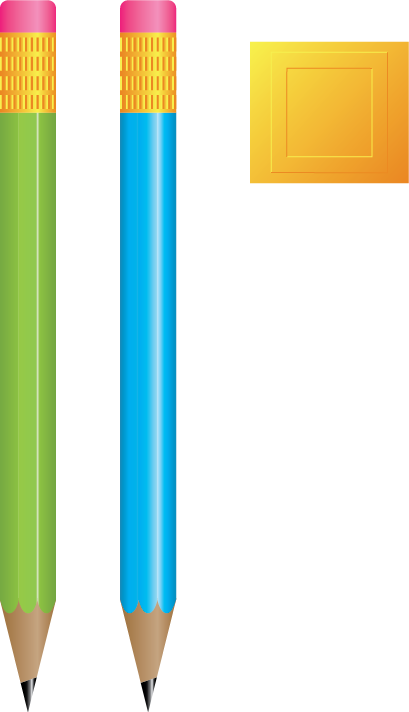
</td>
          <td align='center' width=33% style="height:40px" id='t6'>
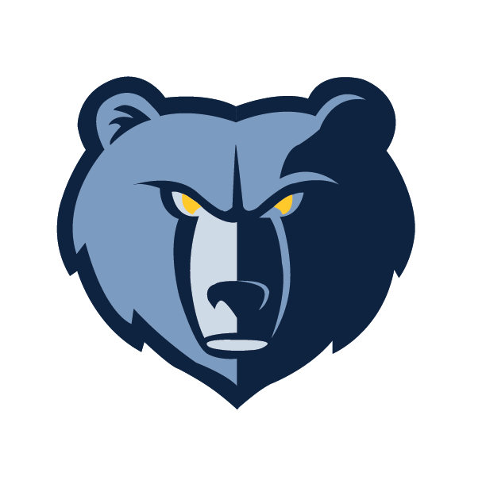
</td>
          <td align='center' width=33% style="height:40px" id='t6'>

</td>
        </tr>

        <tr>
          <td align='center' width=33% style="height:40px" id='t6'>

</td>
          <td align='center' width=33% style="height:40px" id='t6'>
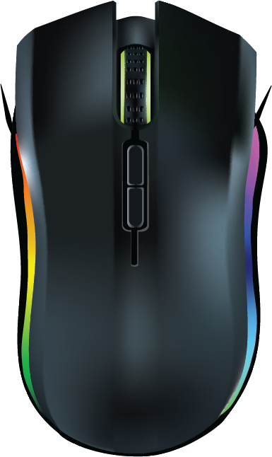
</td>
           <td align='center' width=33% style='padding:15px;height:40px' id='t6'>

</td>
        </tr>

        <tr>
          <td align='center' width=33% style="height:40px" id='t6'>
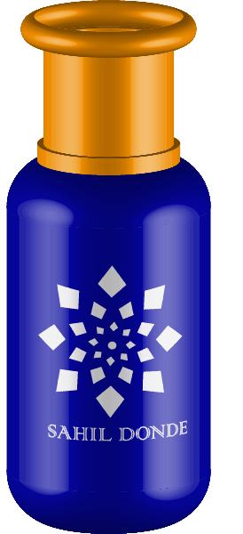
</td>
          <td align='center' width=33% style="height:40px" id='t6'>
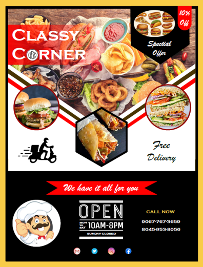
</td>
           <td align='center' width=33% style='padding:15px;height:40px' id='t6'>

</td>
        </tr>

        <tr>
          <td align='center' colspan = 2 width=50% style="height:40px" id='t6'>
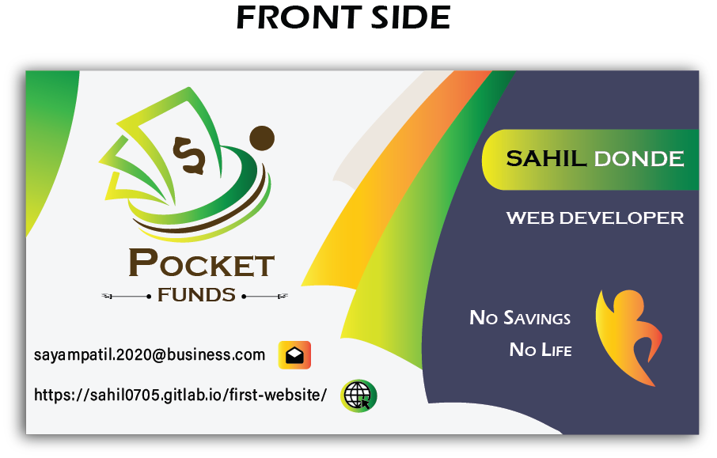
</td>
          <td align='center' width=50% style="height:40px" id='t6'>
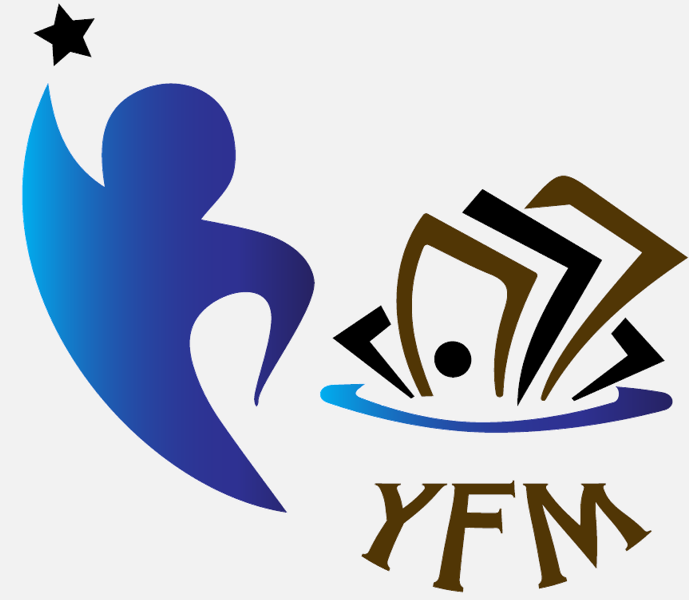
</td>
        </tr>

        <tr>
          <td align='center' colspan = 2 width=50% style="height:40px" id='t6'>
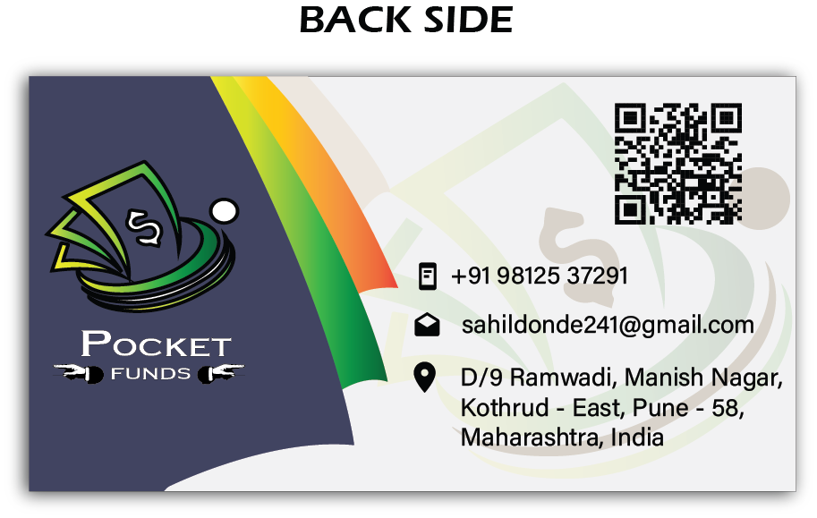
</td>
          <td align='center' width=50% style="height:40px" id='t6'>
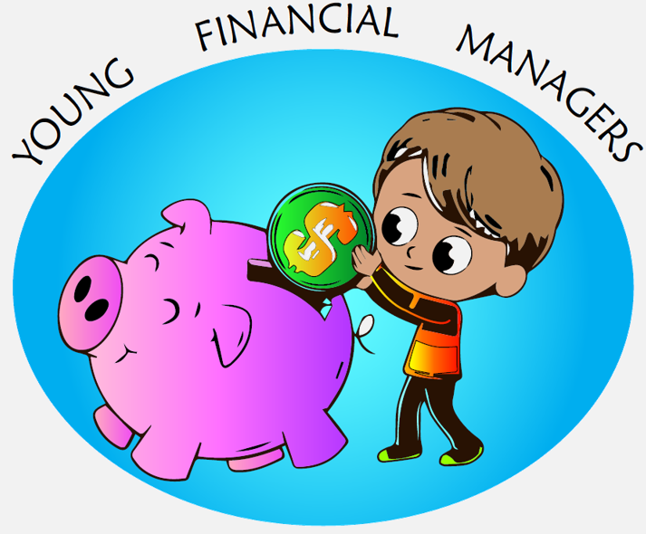
</td>
        </tr>
        
      
      </table> 
      

   
<table align='center' width=100% style="background-color: white;">
<tr><td width=100%> 
<i><b> Career Objective</b></i> 

To obtain a position that will allow me to use my technical skills and willingness to learn in making an organization successful
 </td></tr>
</table> 

Total Views :-

<!-- hitwebcounter Code START -->
       
  

Unique Views :-

<!-- hitwebcounter Code START -->
 
 
  
<table align='center' width=100% style="background-color: white;">
  <tr><td align='center' colspan=2><b><h2 align='center' style="font-size:40px; font-family:Times-Italic;"><i><b>Contact Details</b></i></h2></b> </td></tr>
  <tr>
    <td align='right'>&nbsp;&nbsp; </td>
    <td><h2 style="font-size: 24px;"> &nbsp;&nbsp;<a href="mailto:sahildonde7@gmail.com" target="_blank">sahildonde7@gmail.com</a></h2></td>
  </tr>
  <tr>
    <td align='right'>&nbsp;&nbsp; </td>
    <td><h2 style="font-size: 24px;"> &nbsp;&nbsp;<a href='https://www.linkedin.com/in/sahil-donde-b788a4193/' target="_blank">www.linkedin.com/in/sahil-donde-b788a4913</a></h2></td>
  </tr>
  <tr>
    <td align='right'>&nbsp;&nbsp;   </td>
    <td><h2 style="font-size: 24px;"> &nbsp;&nbsp;<a href="https://www.instagram.com/sahil_donde_751/" target="_blank">sahil_donde_751</a></h2>  </td>
  </tr>
  <tr><td></td></tr>
</table>
   
<table width=100% height=60px style="bottom:0; left:0; right:0; background-color: black;">
  <tr><td align='center'>Copyright 2021 @Sahil Sachin Donde</td></tr></table>

  

</body>
</html>
